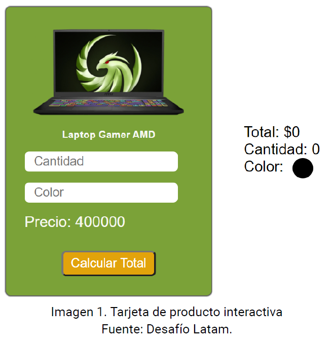
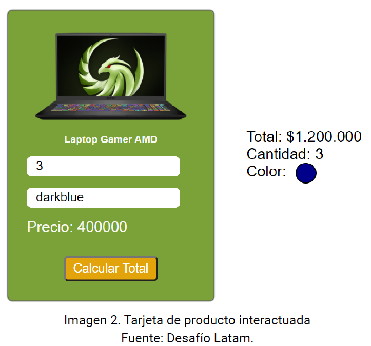

# **Desafío 1 - Calculando el total**
El objetivo es implementar la tarjeta de un producto expuesto en una tienda online y agregar interacción de usuario permitiendo modificar la cantidad y el color del producto.
## **Descripción**
Deberás hacer uso de las herramientas que aprendimos para manipular elementos del DOM como el método querySelector y la modificación de estilos a través del objeto style de cada elemento.

A continuación te mostramos lo que debes maquetar:

El usuario deberá poder tipear la cantidad del producto y el color por medio de los inputs, posteriormente al presionar el botón Calcular Total se deberá mostrar a la derecha el Total a pagar por el producto, la cantidad y el color especificado.

## **Requerimientos**
1. Agregar todos los elementos necesarios dentro del HTML **(1 punto)**.
1. Agregar el evento en el elemento correcto utilizando el tipo de evento pedido **(2 puntos)**.
1. Seleccionar y guardar en variables los elementos a modificar **(1 punto)**.
1. Modificar el DOM para actualizar el total a pagar **(2 puntos)**.
1. Modificar el DOM para actualizar la cantidad de productos especificado en el input **(2 puntos)**.
1. Modificar el DOM para cambiar el color del círculo utilizando el especificado por el usuario **(2 puntos)**.

## **Documentación**
- [Introducción a JavaScript | Desafío Latam](https://mega.nz/file/6TAkwTgJ#i8dSC3QqQGGxF0QanO5uGGvx0yOvAYx_3nlOKo3b378)
- [Guía de estudio | Desafío Latam](https://mega.nz/file/mXZHhQRD#IBpcJ6-ykHOBusW7VduSIbHsI4fVDjLTMqZpxGdXwGQ)

¡Mucho éxito!